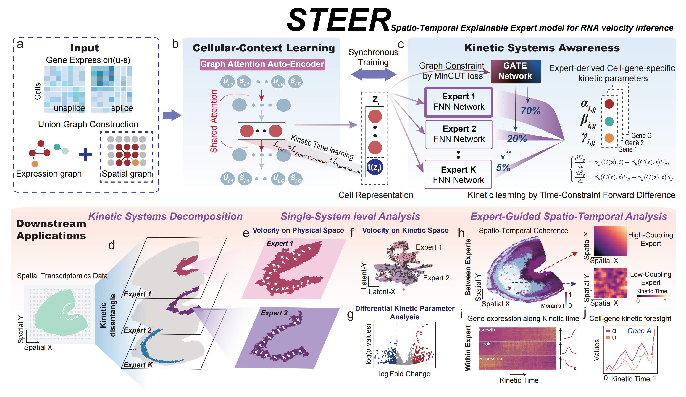

Spatial RNA Velocity

# STEER

**Decoupling kinetics with a spatial-temporal explainable expert model for RNA velocity inference**

STEER is an interpretable deep learning framework that combines spatial context, graph attention, and kinetically guided mixture-of-experts modeling to resolve heterogeneous RNA velocity dynamics in complex tissues.

[Open Quick Start](quickstart.md)
[Browse Tutorials](tutorials/index.md)

-   :material-rocket-launch: **Quick Start**

    ---

    Start with the structured quick start notebook for prepared spatial transcriptomics data.

    [Open Quick Start](quickstart.md)

-   :material-tools: **Installation**

    ---

    Set up Python, PyTorch, PyG, and optional R dependencies.

    [Open Installation Guide](installation.md)

-   :material-book-open-page-variant: **Tutorials**

    ---

    Explore the core pipeline and platform-specific preprocessing workflows.

    [Browse Tutorials](tutorials/index.md)

-   :material-format-quote-close: **Citation**

    ---

    Use the published reference and DOI when citing STEER.

    [See Citation](citation.md)

## Overview

RNA velocity provides a powerful framework for understanding cell-state dynamics by modeling spliced and unspliced mRNA captured by single-cell or spatial transcriptomic technologies. However, many existing approaches rely on restrictive kinetic assumptions and may struggle in the presence of heterogeneous kinetic regimes, especially in complex biological tissues.

STEER was developed to address this problem through a flexible and interpretable framework that combines:

- **Spatially informed graph-attention auto-encoding**
- **Kinetically guided mixture-of-experts modeling**
- **Cell-gene-specific kinetic rate inference**
- **Cell-level latent time estimation**

By assigning cells to expert-defined kinetic regimes, STEER helps disentangle kinetically and spatially mixed populations and supports biologically meaningful downstream analysis.

## Method Overview

STEER integrates cellular-context learning with kinetic-systems-aware modeling. The method figure below summarizes the overall workflow, including graph construction, graph attention auto-encoding, kinetic regime decomposition, expert-specific parameter inference, and downstream spatio-temporal analysis.

## Key Features

- **Interpretable RNA velocity inference** in heterogeneous kinetic settings
- **Spatial-temporal modeling** for single-cell and spatial transcriptomics
- **Graph-attention-based representation learning**
- **Mixture-of-experts decomposition** for kinetic disentangling
- **Cell-gene-specific kinetic parameter inference**
- **Latent time learning and downstream spatio-temporal analysis**

## Documentation Guide

This documentation is organized around the main STEER workflow:

1. **Installation**  
   Prepare the Python environment, PyTorch, PyG libraries, and optional R dependencies.

2. **Quick Start**  
   Start with the guided quick start notebook if your input `.h5ad` already contains `spliced`, `unspliced`, and spatial coordinates.

3. **Tutorials**  
   Follow the quick start notebook or a platform-specific preprocessing route for generating spliced/unspliced matrices from raw data.

4. **Citation**  
   Use the published paper reference and DOI in manuscripts, slides, and supplementary materials.

## Available Tutorials

Current tutorial routes include:

- **STEER Quick Start Notebook**
- **Slide-seq Pipeline**
- **10x Visium Pipeline**
- **Stereo-seq Pipeline**

If your input data already includes `spliced` and `unspliced` layers, you can directly apply the STEER workflow. For the spatial quick start shown in this documentation, `X_spatial` is also expected. Otherwise, please refer to the platform-specific preprocessing tutorials.

## Biological Scope

In benchmarking on synthetic and challenging real-world datasets, STEER demonstrated robust performance and improved interpretability. In particular, it revealed spatiotemporally complementary immunoregulatory programs at the maternal–fetal interface of mouse uterus.

## Source Code

The STEER repository is available on GitHub:

[STEER on GitHub](https://github.com/lzygenomics/STEER)

## Contact

If you encounter any issues or have questions, please open an issue on GitHub or contact:

**lzy_math@163.com**
